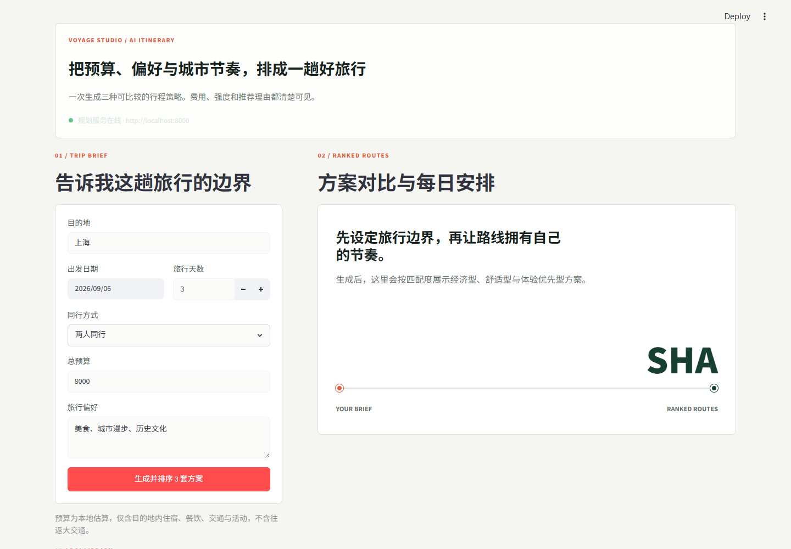
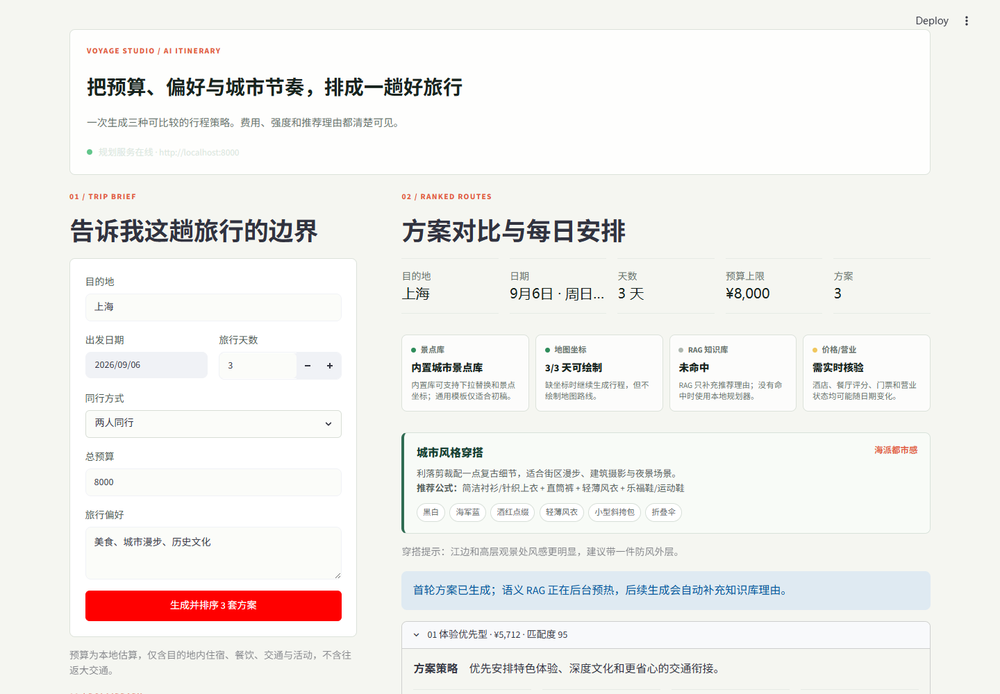

# RAG-based AI Travel Planner

A portfolio project that generates structured travel itineraries with a Streamlit interface, a FastAPI backend, local POI data, budget estimation, route visualization, and retrieval-augmented generation.

Repository: [wanghaorui413-stack/ai-trip-planner](https://github.com/wanghaorui413-stack/ai-trip-planner)

## Screenshots

### Trip brief and POI library



### Ranked itinerary results



## Overview

Users enter a destination, travel dates, budget, travel intensity, companions, and preferences. The app retrieves local travel context when available, combines it with a local POI catalog and planning logic, then generates ranked itinerary options with cost breakdowns, daily routes, food suggestions, map links, and practical travel notes.

## Features

- Streamlit user interface for trip input and itinerary comparison
- FastAPI backend with health checks and planning endpoints
- Retrieval-augmented generation using a local travel knowledge base
- FAISS-based semantic search
- Local POI catalog with route maps and replacement options
- Budget estimation for attractions, food, accommodation, local transport, and buffer costs
- Ranked itinerary options for different travel styles
- Fallback planning when the RAG knowledge base is unavailable or has no match

## Tech Stack

- Python
- Streamlit
- FastAPI
- FAISS
- Sentence Transformers
- LangChain
- Gemini API
- Docker Compose

## Project Structure

```text
.
|-- streamlit_app.py
|-- single_main.py
|-- single_trip_agent.py
|-- planner.py
|-- trip_catalog.py
|-- api_routes.py
|-- rag_processor.py
|-- knowledge_base/
|-- faiss_store/
|-- assets/
|   `-- screenshots/
|-- requirements.txt
|-- docker-compose.yml
|-- Dockerfile
|-- .env.example
`-- README.md
```

## Local Setup

Create a virtual environment and install dependencies:

```bash
python -m venv .venv
.venv\Scripts\activate
pip install -r requirements.txt
```

Create a local `.env` file:

```bash
copy .env.example .env
```

Then set `GEMINI_API_KEY` in `.env` if you want live Gemini generation. The app still has local fallback behavior for cases where semantic RAG or model-backed generation is unavailable.

## Run Locally

Start the FastAPI backend:

```bash
.venv\Scripts\python -m uvicorn single_main:app --host 127.0.0.1 --port 8000
```

Start the Streamlit frontend in a second terminal:

```bash
.venv\Scripts\python -m streamlit run streamlit_app.py --server.port 8501 --server.address 127.0.0.1
```

Open:

```text
http://127.0.0.1:8501
```

Health check:

```text
http://127.0.0.1:8000/health
```

## Docker

You can also run both services with Docker Compose:

```bash
docker compose up --build
```

Frontend:

```text
http://127.0.0.1:8501
```

Backend:

```text
http://127.0.0.1:8000
```

## Notes

- Hotel prices, restaurant ratings, tickets, and opening hours can change and should be checked before real travel.
- The local budget estimator covers destination-side costs and does not include long-distance transport to or from the destination.
- RAG context improves recommendation explanations when the local knowledge base matches the query; otherwise the app falls back to local planning logic.
