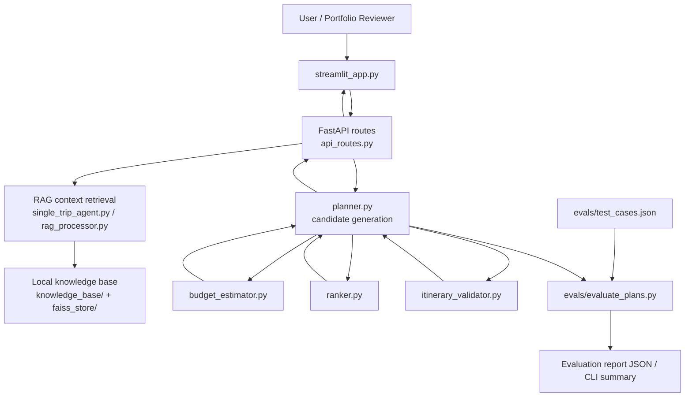

# AI Trip Planner RAG Architecture

## 1. 架构摘要

本项目是一个 RAG + 规则化规划的旅行方案生成 MVP。系统将自然语言旅行需求转化为结构化输入，结合本地知识库检索、mock POI/酒店/交通规则、预算估算、候选排序和校验器，输出多套可比较的行程方案。

当前阶段为 MVP mock data：架构目标是展示 AI 旅行规划产品的端到端闭环和可评测性，不承担真实预订、支付、库存确认或实时出行决策职责。

## 2. 系统边界

### 系统内

- Streamlit 交互界面。
- FastAPI API 路由。
- 本地 RAG 检索与 FAISS 向量库。
- 确定性 itinerary planner。
- 预算估算、排序、校验与 warning。
- 离线评测脚本和合成 test cases。

### 系统外

- 真实酒店/门票/交通库存。
- 实时价格、实时营业时间和实时路线。
- 支付、订单、账户和用户画像系统。
- 真实用户行为数据或个人身份信息。

## 3. 组件图



## 4. 核心模块

| 模块 | 职责 | 主要输入 | 主要输出 |
| --- | --- | --- | --- |
| `streamlit_app.py` | 用户界面与方案展示 | 表单输入、API 响应 | 可视化行程、预算、候选对比 |
| `single_main.py` | FastAPI 应用入口 | HTTP 请求 | API 服务 |
| `api_routes.py` | 请求校验与业务编排 | destination、days、budget、preferences、traveler_type | `data` 包裹的旅行方案 |
| `rag_processor.py` | 文档加载、切分、向量检索 | 本地知识库文件 | RAG context |
| `single_trip_agent.py` | RAG 查询与兼容旧 agent 能力 | 查询文本、vector_db | context、sources |
| `planner.py` | 生成多候选 itinerary | 目的地、天数、预算、偏好、RAG context | ranked candidates |
| `budget_estimator.py` | 估算本地旅行成本 | candidate、目的地、天数、同行类型 | budget_breakdown、total_budget |
| `ranker.py` | 多指标排序 | candidates、budget、preferences | score、rank |
| `itinerary_validator.py` | 结构与约束校验 | candidates、budget、days | warnings、is_valid |
| `evals/evaluate_plans.py` | 离线质量评测 | test cases、planner output | metrics、diagnostics、summary |

## 5. 数据流

1. 用户在 UI 或 API 中提交旅行需求。
2. API 将目的地和偏好拼成 RAG query。
3. RAG 模块从本地知识库和 FAISS index 检索上下文与 sources。
4. Planner 根据目的地 POI、策略 profile、偏好和同行类型生成候选方案。
5. Budget estimator 计算 POI、住宿、餐饮、本地交通和 contingency。
6. Ranker 计算预算匹配、偏好匹配、强度和多样性得分，并排序。
7. Validator 检查字段完整性、预算、天数和每日 POI 负载。
8. API 返回结构化结果，UI 展示候选方案。
9. Evals 可直接调用 planner 或读取预测 JSON，对质量指标做离线评测。

## 6. 输出结构

`plan_trip(...)` 返回的核心结构：

```json
{
  "destination": "shanghai",
  "days": 2,
  "budget_limit": 1800,
  "preferences": "food history",
  "traveler_type": "solo",
  "currency": "CNY",
  "rag": {
    "used_for": "explanation_and_recommendation_reasons_only",
    "sources": []
  },
  "candidates": [
    {
      "id": "economy",
      "title": "...",
      "strategy": "...",
      "daily_plan": [],
      "hotel_option": {},
      "transport_summary": {},
      "budget_breakdown": {},
      "total_budget": 0,
      "score": {},
      "warnings": [],
      "rank": 1,
      "is_valid": true
    }
  ]
}
```

## 7. RAG 设计

RAG 在当前架构中承担“解释增强”角色，而不是直接生成不可控行程。检索内容主要用于推荐理由、城市提示和背景补充。预算、候选数量、每日 POI 上限、同行类型节奏等关键约束由本地确定性模块控制。

这种设计的好处是：

- 输出更稳定，便于离线评测。
- 降低大模型幻觉对预算和结构化字段的影响。
- 可以逐步替换或升级 RAG source，而不破坏 planner contract。

## 8. 预算与排序链路

预算估算采用 mock 规则：

- 目的地成本系数。
- 同行类型人数、房间数和交通系数。
- 经济型、舒适型、体验优先型成本 profile。
- POI、住宿、餐饮、本地交通和预留金拆分。

排序器使用多指标加权：

- `budget_match`：总费用与预算约束的匹配度。
- `preference_match`：候选内容对偏好的覆盖度。
- `intensity`：每日 POI 数量与同行类型节奏的匹配度。
- `diversity`：POI 类别多样性和重复惩罚。

## 9. 校验与 warning

Validator 负责发现用户可见风险和系统 contract 漂移：

- 必要字段缺失。
- 总费用超预算。
- `daily_plan` 天数与请求不一致。
- 每日 POI 数量超过同行类型上限。
- POI、酒店、交通摘要字段不完整。

`warnings` 同时服务前端展示和离线评测中的 `warning_count` 指标。

## 10. 评测架构

`evals/test_cases.json` 保存合成旅行场景，覆盖目的地、天数、预算、偏好和同行类型组合。`evals/evaluate_plans.py` 可在两种模式运行：

- 本地生成模式：直接调用 `planner.plan_trip`。
- 预测评测模式：读取外部 predictions JSON。

评测输出包含 `budget_fit`、`preference_match`、`plan_completeness`、`daily_load`、`warning_count` 和诊断信息，用于发现 bad cases 与回归风险。

## 11. 部署形态

当前可作为本地 demo 运行：

- Streamlit：适合产品作品集展示和交互演示。
- FastAPI：适合展示服务化接口与前后端分离潜力。
- Docker / docker-compose：提供基础容器化入口。

生产化前需要补齐：

- 配置管理和密钥管理。
- 真实数据源接入与 source freshness。
- API 鉴权、限流和 observability。
- 数据隐私、用户删除、日志脱敏策略。

## 12. 安全与隐私

当前 MVP 不处理真实用户身份、联系方式、支付、订单或位置轨迹。日志和评测数据应只保存合成输入和 mock 输出。未来若接入真实用户数据，需要增加：

- 明确的数据最小化策略。
- 用户同意与删除机制。
- 日志脱敏。
- 第三方供应商数据使用说明。
- 高风险出行建议的免责声明和官方来源核对。

## 13. 已知限制

- POI 和酒店数据覆盖有限，部分城市使用泛化 POI。
- 预算为本地估算，不代表真实价格。
- RAG source 不是实时更新，不保证准确性。
- 当前路线没有真实地理距离和交通时间优化。
- 偏好匹配主要基于 tags/category/text terms，尚未引入人工标注或真实反馈。

## 14. 后续演进

1. 增加 structured city graph：POI 坐标、开放时间、适合人群、区域聚类。
2. 引入 route optimizer：按距离、营业时间和用户节奏调整顺序。
3. 建立 feedback loop：保存匿名、合规的用户反馈和人工评审标签。
4. 接入真实数据源：地图、官方开放时间、价格、预订跳转。
5. 引入 experiment framework：按版本跟踪评测指标与用户行为指标。
